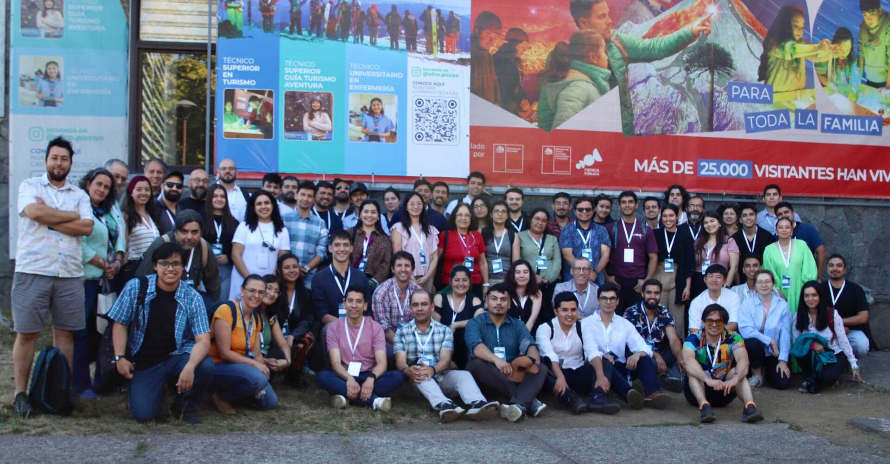
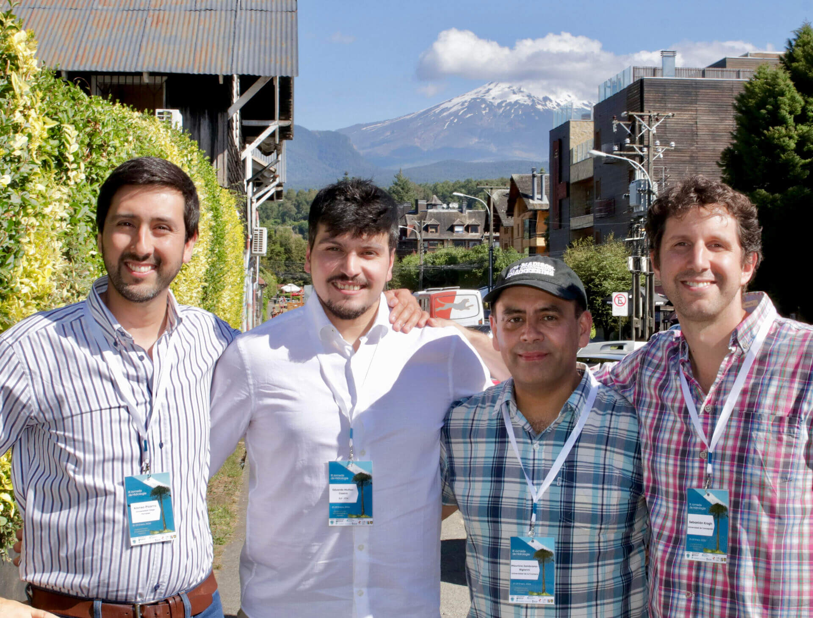
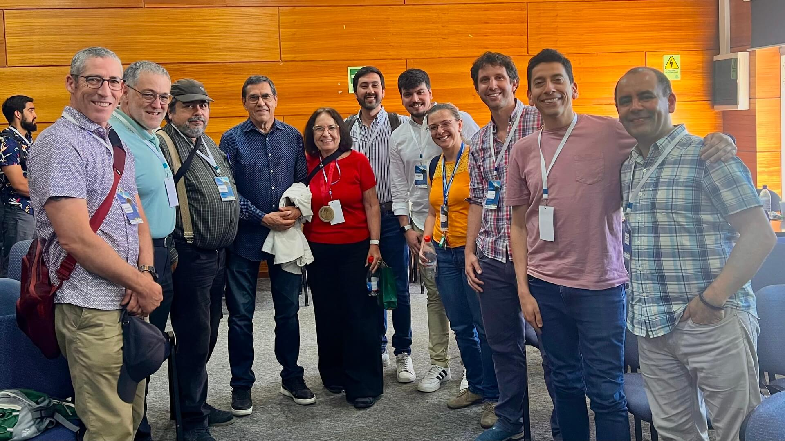
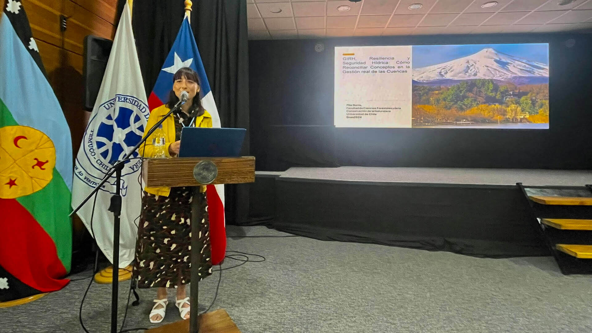
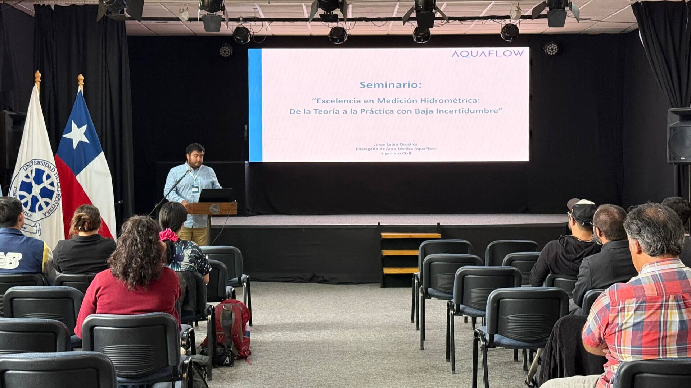
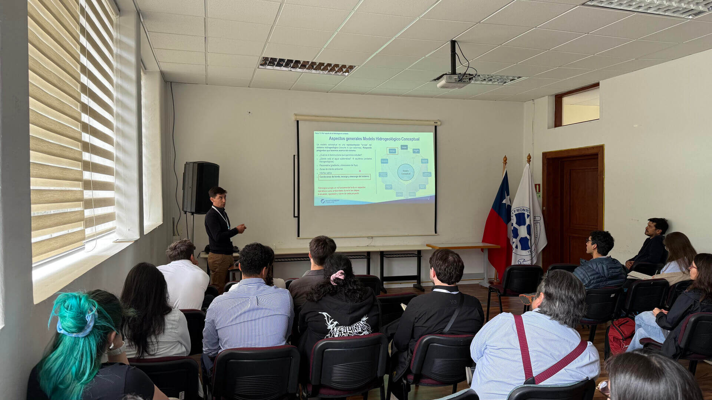
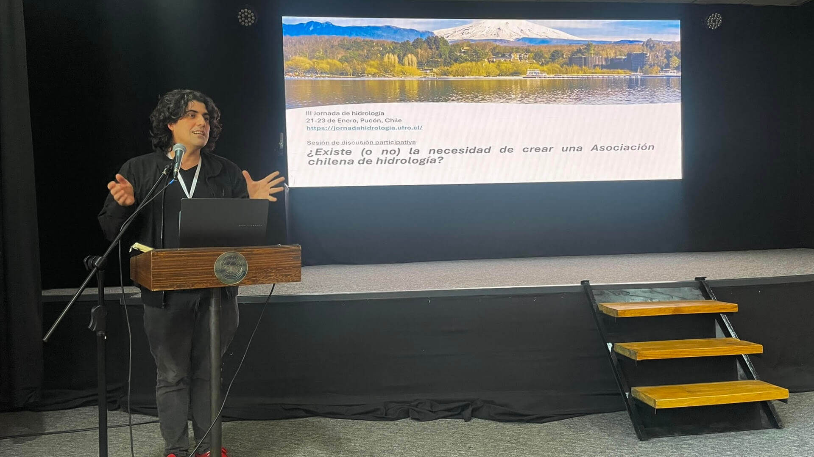
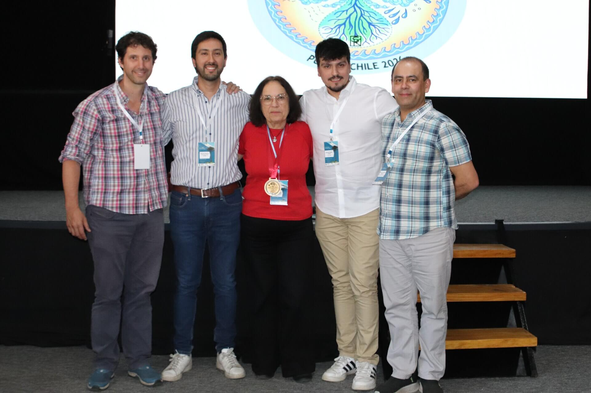
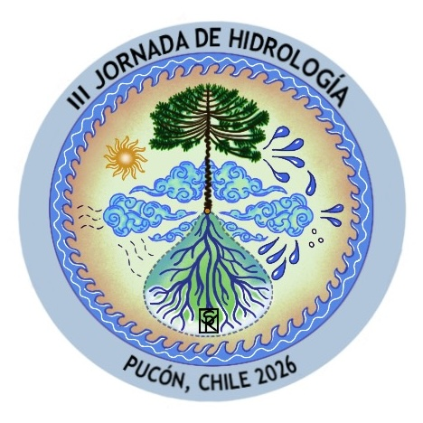
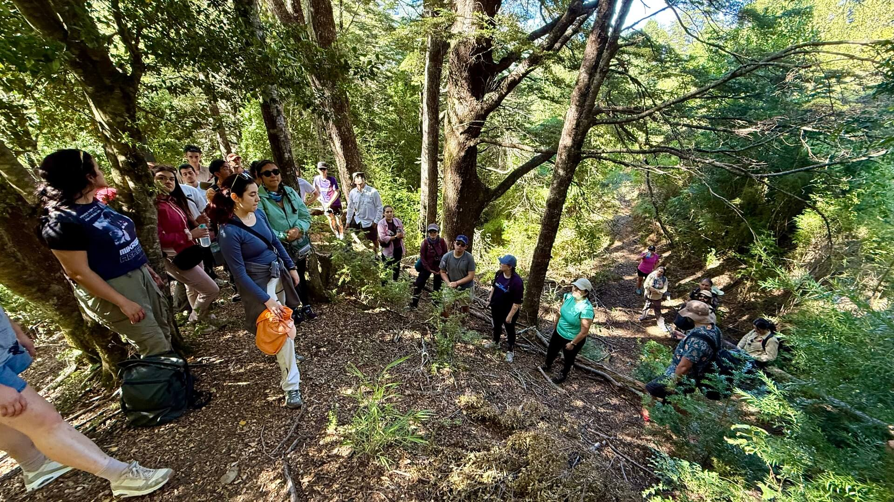

# Resumen de la III Jornada de Hidrología

Durante el 21 y 23 de Enero de 2026, el Campus Pucón de la Universidad de La Frontera fue el punto de encuentro de la comunidad hidrológica nacional en el marco de la **III Jornada de Hidrología**, una instancia que reafirmó su rol como espacio de articulación entre investigación científica, práctica profesional y gestión pública del agua en Chile.

 

**Figura 1**. Participantes de la III Jornada de Hidrología.

La actividad fue liderada por el **Dr. Mauricio Zambrano-Bigiarini**, académico del Departamento de Ingeniería de Obras Civiles de la UFRO, y contó con un comité organizador integrado además por el **Dr. Alonso Pizarro** (Universidad Diego Portales), el **Dr. Sebastián Krogh** (Universidad de Concepción) y el **Dr.(c) Eduardo Muñoz-Castro** (SLF - ETH).

 

**Figura 2**. Comité organizador de la III Jornada de Hidrología.

En un contexto marcado por una alta variabilidad climática, sequías persistentes y un aumento en la recurrencia de eventos hidrometeorológicos extremos, la hidrología se posiciona como una disciplina estratégica para la toma de decisiones informadas. En este escenario, la III Jornada de Hidrología reunió a investigadores(as), profesionales del sector público y privado, y estudiantes de pre y postgrado provenientes de distintas regiones del país, generando un espacio de intercambio transversal y colaborativo.

 

**Figura 3**. Profesores que participaron durante el evento.

El programa científico incluyó sesiones temáticas sobre eventos extremos, hidrología de montaña, hidroinformática y diseño hidrológico, además de presentaciones orales, sesiones de pósters y charlas magistrales. Entre estas últimas destacó la conferencia **“Seguridad hídrica en Chile: caracterización y perspectivas de futuro”**, dictada por la Dra. Camila Álvarez Garretón, investigadora del Centro de Ciencia del Clima y la Resiliencia (CR2), quien abordó los principales desafíos y escenarios futuros asociados a la disponibilidad y uso del agua en el país.

 

**Figura 4**. Dra. Camila Álvarez-Garretón durante su charla magistral, titulada "Seguridad hídrica en Chile: caracterización y perspectivas de futuro".

Como parte fundamental de la Jornada, se desarrollaron **tres cursos especializados**, orientados a fortalecer capacidades técnicas y profesionales en distintas áreas de la gestión hídrica. El **Curso 1**, titulado *GIRH, Resiliencia y Seguridad Hídrica: Cómo reconciliar conceptos en la gestión real de las cuencas*, fue impartido por la **Dra. Pilar Barría**, académica de la Universidad de Chile.

 

**Figura 5**. Dra. Pilar Barría impartiendo el Curso 1.

El **Curso 2a**, *Excelencia en medición hidrométrica: de la teoría a la práctica con baja incertidumbre*, estuvo a cargo de **Jorge Labra**, representante de **AQUAFLOW**, mientras que el **Curso 2b**, enfocado en la *estimación de recursos hídricos en proyectos de litio*, fue dictado por **Diego Ojeda**, de **Montgomery & Associates Chile**. Estas instancias formativas tuvieron una alta convocatoria y destacaron por su enfoque aplicado y su conexión directa con problemáticas reales del sector.

 
 

**Figura 6**. Ingeniero Jorge Labra (imagen superior) e Ingeniero Diego Ojeda (imagen inferior) presentando sus cursos.

Como parte de las actividades de reflexión colectiva, se desarrolló una **discusión participativa titulada "¿Existe (o no) la necesidad de crear una Asociación Chilena de Hidrología?"**, dirigida por el Dr. Francisco Salinas (Universidad Alberto Hurtado) y el Dr. (c) Eduardo Muñoz. Esta instancia tuvo como objetivo abrir un espacio de diálogo informado respecto a la eventual institucionalización de una asociación nacional que represente a la comunidad hidrológica del país. Para ello, las y los participantes fueron organizados en grupos según su ámbito de pertenencia: estudiantes, sector público, sector privado y academia, con el fin de recoger distintas miradas, necesidades y expectativas en torno al rol, alcances y pertinencia de una organización de este tipo.

 

**Figura 7**. Dr. Francisco Salinas liderando la discusión participativa.

En esta Jornada de Hidrología se instituyó la **medalla "Premio Chileno de Hidrología"**, orientada a reconocer la trayectoria profesional y el aporte a la comunidad hidrológica nacional. En su primera versión, la medalla fue otorgada a la profesora Ximena Vargas Mesa (Universidad de Chile), destacada académica que, en palabras de sus propios alumnos y colaboradores, ha dejado una huella imborrable en la historia de la hidrología de Chile y en los profesionales que ha formado.

 

**Figura 8**. Profesora Ximena Vargas recibiendo la medalla "Premio Chileno de Hidrología".

En coherencia con este espíritu de reconocimiento y legado, la medalla Premio Chileno de Hidrología fue diseñada por Stephanie Seria, hidróloga en EFE. La ilustración representa una cuenca hidrográfica como un sistema dinámico e interconectado, parte de un todo que, en la búsqueda de equilibrio, converge sus aguas hacia un punto que nutre, sostiene y posibilita la vida en todas sus formas. Como resultado, el nacimiento de una araucaria, el cual simboliza la dependencia mutua entre agua, territorio y sus comunidades.

 

**Figura 9**. Ilustración de la medalla "Premio Chileno de Hidrología".

Uno de los momentos más valorados por las y los participantes fue la concurrida salida a terreno, orientada a conocer en detalle el entorno natural y los puntos de monitoreo que sustentan el estudio hidrológico en la cuenca del **Río Trancura antes de Llafenco**. La actividad comenzó en el Campus Pucón de la UFRO y se trasladó hasta **PuAm Ecolodge**, donde se visitaron una estación meteorológica y una estación de monitoreo de humedad del suelo.

 
 
 

**Figura 10**. Participantes de la salida a terreno en PuAm Ecolodge.

El recorrido incluyó un trekking por vegetación nativa, permitiendo a las y los asistentes observar directamente las condiciones locales que influyen en los procesos hidrológicos. Durante la salida se realizaron además mediciones simples en terreno, como ensayos de infiltración, con el objetivo de ilustrar cómo se manifiesta el comportamiento del agua a escala local y su relación con la modelación hidrológica.

  

    <iframe
      src="https://www.youtube.com/embed/xyzkt6zGCjI?si=rYOgptkDfT3OPnkS"
      allow="accelerometer; autoplay; clipboard-write; encrypted-media; gyroscope; picture-in-picture; web-share"
      allowfullscreen
      loading="lazy">
    </iframe>
  

La organización de la III Jornada de Hidrología agradeció especialmente el **apoyo financiero** de **AQUAFLOW**, **Montgomery & Associates Chile**, **Vertientes** y **IECOM**, cuyo respaldo fue clave para la realización de esta instancia.

Con una alta participación y una diversidad de miradas disciplinarias, la III Jornada de Hidrología cerró reafirmando la importancia de fortalecer redes, compartir conocimiento y avanzar hacia una gestión del agua basada en evidencia científica, colaboración interinstitucional y pertinencia territorial, consolidándose como un evento de referencia para la hidrología en Chile.
