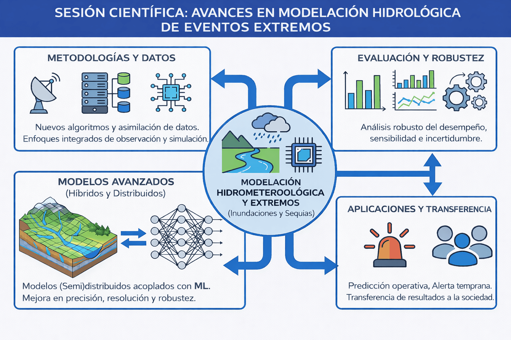
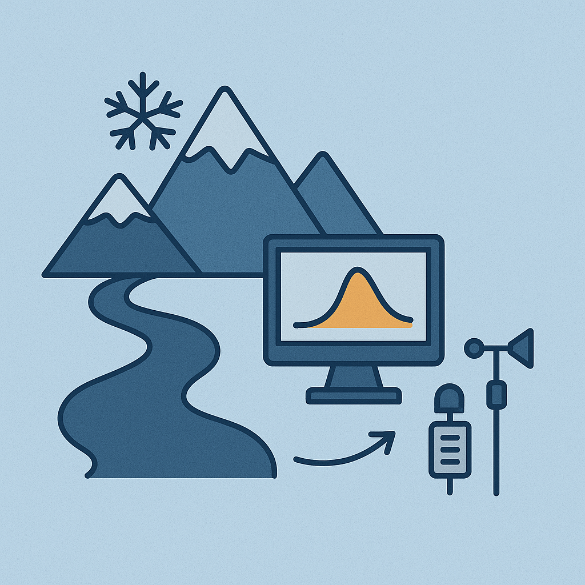
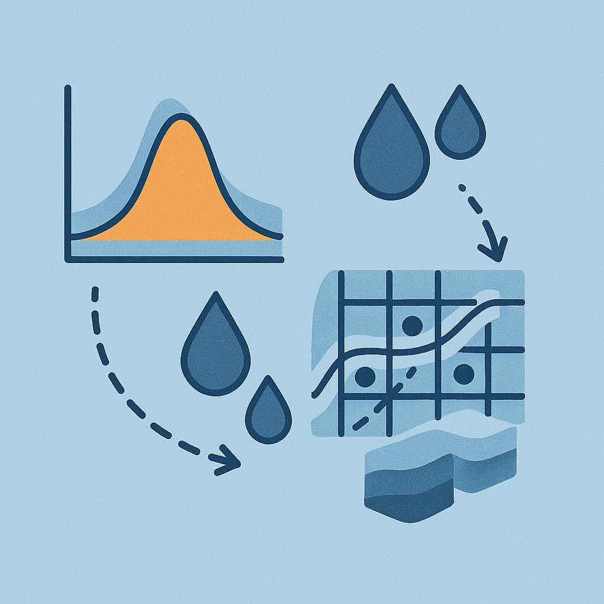
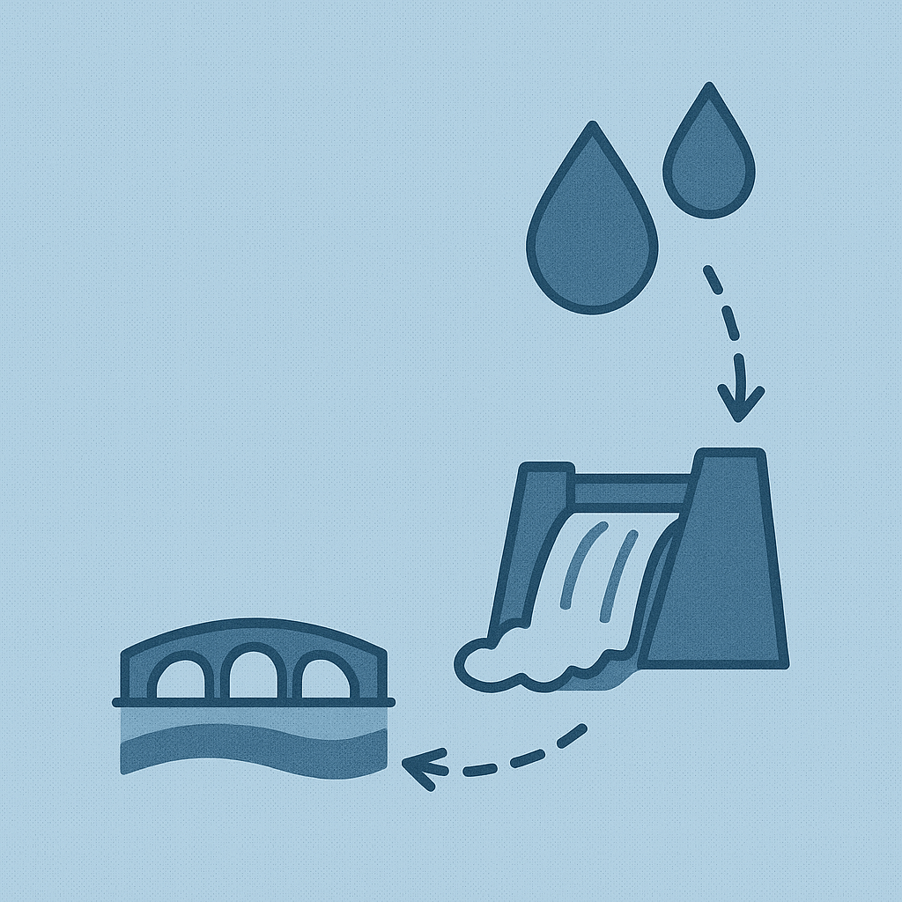

# Sesiones temáticas

  

    <h3>Sesión 1 - Extremos hidrometerológicos: caracterización, modelación y pronósticos</h3>
    <h5><strong>Convener: Mauricio Zambrano-Bigiarini</strong></h5>
    
    

    Esta sesión se centrará en los avances científicos y tecnológicos sobre modelación hidrológica, orientados a comprender, predecir y monitorear eventos hidrometeorológicos extremos, especialmente inundaciones y sequías. Se invita a presentar contribuciones que aborden, entre otros, los siguientes temas:
    

    <ul>
      <li>Metodologías de modelación hidrológica e hidrometeorológica de eventos extremos.</li>
      <li>Uso de nuevos conjuntos de datos, algoritmos y técnicas de asimilación de datos.</li>
      <li>Desarrollo de enfoques integrados de observación y simulación.</li>
      <li>Modelos (semi)distribuidos y/o acoplados que mejoren la precisión, resolución temporal y espacial, y robustez de las simulaciones.</li>
      <li>Análisis de sensibilidad e incertidumbre de los modelos utilizados.</li>
    </ul>
  

---

  

    <h3>Hidrología de Montaña: monitoreo, modelación e interacción de procesos</h3>
    <h5><strong>Convener: Sebastián Krogh</strong></h5>
    
    

    Esta sesión incluye trabajos relacionados con el estudio de la hidrología de montaña que contribuyan a un mejor entendimiento y cuantificación de la dinámica hidrológica de las cuencas cordilleranas. Análisis empíricos de observaciones hidrometeorológicas en cuencas de montaña (e.g., nieve y glaciares, precipitación, viento, humedad del suelo y caudales) para mejorar el entendimiento de procesos físicos y/o la calibración de modelos. Aplicación de modelos hidrológicos (agregados, semidistribuidos o distribuidos) para análisis de diagnóstico de caudales de deshielo, eventos extremos, disponibilidad de recursos hídricos e interacción de procesos hidrológicos. Proyecciones bajo escenarios de cambio climático y otras aplicaciones afines.
    

  

---

  

    <h3>Sesión 3 - Hidroinformática: análisis de datos, pronósticos, aprendizaje automático y evaluación estadística</h3>
    <h5><strong>Convener: Alonso Pizarro</strong></h5>
    
    

    Durante las últimas décadas, la hidroinformática ha emergido como un campo de investigación consolidado en las ciencias hidrológicas. Se centra en el desarrollo y la aplicación de modelos matemáticos, tecnologías de la información y herramientas de inteligencia artificial aplicados a la hidrología. En la actualidad, la hidroinformática aborda la recolección, gestión, análisis y visualización de grandes volúmenes de datos (Big Data) provenientes de sensores remotos, modelos de la Tierra y del clima, así como el diseño de herramientas y tecnologías orientadas a soluciones de gestión inteligente del agua. En el contexto chileno, marcado por una alta variabilidad hidroclimática, la hidroinformática ofrece enfoques y soluciones claves para el análisis, la predicción y la toma de decisiones en sistemas hídricos complejos. Esta sesión tiene como objetivo constituir un foro activo de presentación y discusión sobre la integración y la aplicación adecuada de técnicas y tecnologías emergentes en distintos contextos relacionados con el agua, con énfasis en problemáticas y experiencias relevantes para Chile y América Latina.
    Temáticas de la sesión:
    

    <ul>
      <li>Modelos predictivos y exploratorios basados en estadística, aprendizaje automático y ciencia de datos.</li>
      <li>Avances metodológicos en el pronóstico de variables hidrológicas y meteorológicas.</li>
      <li>Asimilación de datos y corrección de sesgo.</li>
      <li>Métodos de optimización asociados a procedimientos de búsqueda heurística (algoritmos genéticos y evolutivos, búsquedas aleatorizadas y adaptativas) y sus aplicaciones en hidrología.</li>
      <li>Enfoques multimodelo y modelos híbridos, que integran modelos basados en procesos físicos con modelos basados en datos.</li>
      <li>Métodos innovadores para el análisis y la cuantificación de incertidumbre y sensibilidad de los modelos.</li>
      <li>Gemelos Digitales (Digital Twins) en hidrología y recursos hídricos.</li>
    </ul>
  

---

  

    <h3>Sesión 4 - Diseño y aplicaciones hidrológicas en ingeniería: innovaciones para la toma de decisiones, gestión de amenazas y diseño de infraestructura hidráulica</h3>
    <h5><strong>Convener: Eduardo Muñoz-Castro</strong></h5>
    
    

    Esta sesión presentará los avances en las metodologías orientadas al diseño hidrológico, la estimación de parámetros clave, como precipitaciones y caudales asociados a diferentes periodos de retorno, experiencias reales de gestión operacional durante eventos hidrometeorológicos extremos, estudios aplicados, monitoreo de variables hidrometeorológicas e impactos de los cambios hidrológicos en la calidad del agua.
    

    <ul>
      <li>Nuevas metodologías para el diseño y verificación de infraestructura hidráulica en un contexto de variabilidad climática.</li>
      <li>Hidrología urbana y gestión de riesgos de inundaciones y sequías durante contingencias.</li>
      <li>Decisiones operacionales basadas en pronósticos y en lecciones aprendidas de proyectos reales.</li>
      <li>Casos interdisciplinarios entre la academia y los sectores público y privado.</li>
      <li>Experiencias orientadas a fortalecer la resiliencia de la infraestructura hidráulica.</li>
      <li>Aplicaciones de productos meteorológicos grillados en estimaciones hidrológicas.</li>
      <li>Hidrología aplicada al estudio de la calidad del agua.</li>
      <li>Impactos del cambio en el uso de suelos en la hidrología a escala de cuenca.</li>
      <li>Sistemas de monitoreo de variables hidrometeorológicas.</li>
      <li>Gobernanza hídrica.</li>
    </ul>
  

